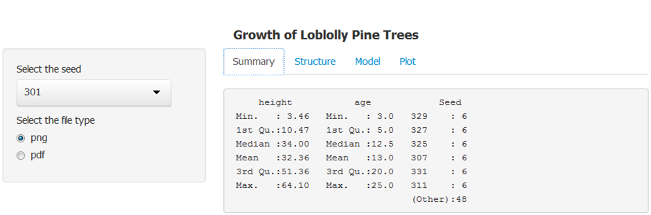
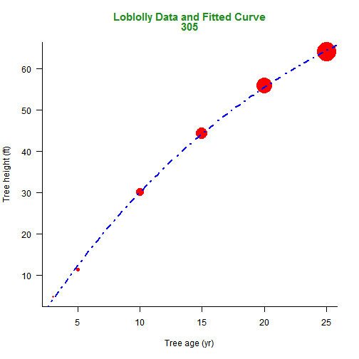

Loblolly Analytic App
===
author: X. SHEN
date: October 25 2014
transition: rotate

<br>
<medium> <b>
Developing Data Product <br>
Data Science Specialization <br>
</b> </medium>

Overview
===

Loblolly Analytic App is an analytical shiny application that summarizes the Loblolly pine tree data and fits a nonlinear model for different seed sources. This App allows the users to download a plot with the fitted curve based on the selected seed source. 

<center>

</center>

Data & Descriptive Statistics
===

<small>
The Loblolly data frame has 84 rows and 3 columns of records of the growth of Loblolly pine trees.
- Height: a numeric vector of tree heights (ft).
- Age: a numeric vector of tree ages (yr).
- Seed: an ordered factor indicating the seed source for the tree.


```r
summary(Loblolly)
```

```
     height           age            Seed   
 Min.   : 3.46   Min.   : 3.0   329    : 6  
 1st Qu.:10.47   1st Qu.: 5.0   327    : 6  
 Median :34.00   Median :12.5   325    : 6  
 Mean   :32.36   Mean   :13.0   307    : 6  
 3rd Qu.:51.36   3rd Qu.:20.0   331    : 6  
 Max.   :64.10   Max.   :25.0   311    : 6  
                                (Other):48  
```
</small>

Fitted Nonlinear Model (seed=305)
===

<small>

```

Formula: height ~ SSasymp(age, Asym, R0, lrc)

Parameters:
     Estimate Std. Error t value Pr(>|t|)    
Asym   99.172      6.724    14.8  0.00068 ***
R0     -9.917      1.304    -7.6  0.00472 ** 
lrc    -3.085      0.112   -27.6  0.00010 ***
---
Signif. codes:  0 '***' 0.001 '**' 0.01 '*' 0.05 '.' 0.1 ' ' 1

Residual standard error: 0.773 on 3 degrees of freedom

Number of iterations to convergence: 0 
Achieved convergence tolerance: 4.98e-07
```
</small>

Plot Fitted Nonlinear Curve (seed=305)
===
<center>
 
</center>
